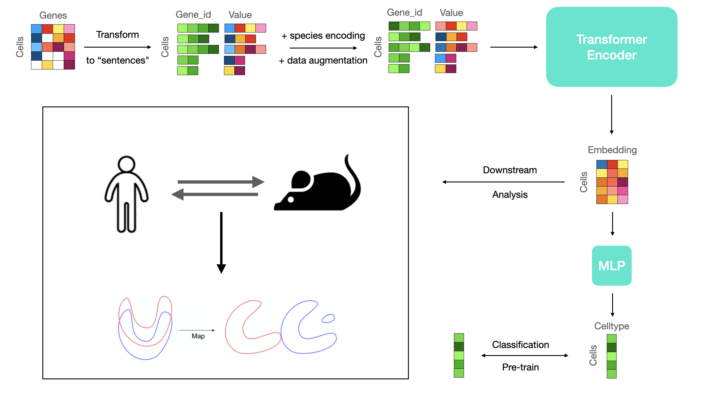

# ScTT-pytorch
scTT: Translating Transcriptional Human-Mouse Single-Cell Signatures using Transformer-based Representational Learning 
</img>
# Example
```python
import torch
from module import ScTT
from dataset import SingleDataset
from torch.utils.data import DataLoader

sctt = ScTT(
    n_genes = 10000,
    n_val = 11,
    n_class = 1000,
    n_species=2
    pooling='mean',
    embed_dim=768,
    n_heads=8,
    n_layers=8,
    lr=1e-4,
)

dataset = SingleDataset(adata,gene2id)
loader = DataLoader(dataset)

sctt.fit(model, loader)
```
# Parameters
- `n_genes`: int.  
  Amount of genes.
- `n_val`: int.  
  Max expression value after preprocessing.
- `n_class`: int.  
  Number of classes to classify.
- `n_species`: int.  
  Number of species.
- `embed_dim`: int.  
  Dimension of the embeddings.
- `n_heads`: int, default `8`.  
   Number of heads in Multi-head Attention layer.
- `n_layers`: int, default `8`.  
  Number of Transformer blocks.
- `lr`: float between `[0, 1]`, default `0.0001`.  
  Learning rate.
- `pooling`: string, either `max` pooling, `min` pooling or `mean` pooling


# References
https://icml-compbio.github.io/icml-website-2020/2020/papers/WCBICML2020_paper_29.pdf
https://www.biorxiv.org/content/10.1101/2020.02.05.935239v2
